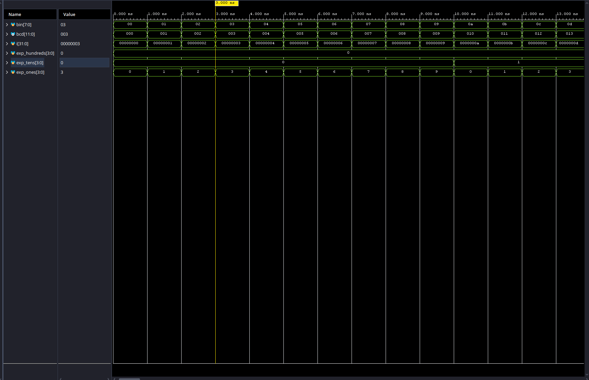

# ECE3300L — Lab 2: Binary-to-BCD Converter and Calculator

## Overview

This lab implements a combinational binary-to-BCD converter using the Double Dabble (shift-add-3) algorithm, then extends the Lab 1 calculator to display results as decimal on the Nexys A7-100T LEDs.

---

## Modules

### Part 1 — Binary-to-BCD Converter

| Module | File | Description |
|--------|------|-------------|
| `add_3` | `add_3.v` | 4-bit building block: passes input unchanged if ≤ 4, adds 3 if 5–9 |
| `bin2bcd` | `bin2bcd.v` | 8-bit binary to 12-bit BCD using 7 `add_3` instances (unrolled double dabble) |
| `bin2bcd_tb` | `bin2bcd_tb.v` | Testbench: exhaustively drives all 256 input values (0–255) |

### Part 2 — Calculator with BCD Output

| Module | File | Description |
|--------|------|-------------|
| `bcd_calc_signed` | `bcd_calc_signed.v` | Top-level: wraps `simple_calc`, handles signed results, outputs 12-bit BCD |

---

## Block Diagram — Part 2

SW7–SW4 ──► y[3:0] ─┐
                     ├─► simple_calc ──► raw[7:0] ──► bcd_calc_signed ──► result[11:0] ──► LED11–LED0
SW3–SW0 ──► x[3:0] ─┘        │                              │
                              ├──► carry_out ────────────────┼──────────────────────────► LED14
                              └──► overflow  ────────────────┼──────────────────────────► LED15
SW15–SW14 ──► op_sel[1:0] ───────────────────────────────────┤
                                                             └──► negative ─────────────► LED13

---

## IO Specification

| Signal | Direction | Board I/O | Description |
|--------|-----------|-----------|-------------|
| `x[3:0]` | Input | SW3–SW0 | First operand |
| `y[3:0]` | Input | SW7–SW4 | Second operand |
| `op_sel[1:0]` | Input | SW15–SW14 | `00`=add, `01`=subtract, `1x`=multiply |
| `result[3:0]` | Output | LED3–LED0 | BCD ones digit |
| `result[7:4]` | Output | LED7–LED4 | BCD tens digit |
| `result[11:8]` | Output | LED11–LED8 | BCD hundreds digit |
| `negative` | Output | LED13 | High when result is negative (subtraction only) |
| `carry_out` | Output | LED14 | Carry/borrow from adder |
| `overflow` | Output | LED15 | Signed overflow flag |

---

## Simulation Waveform

---

## Dependencies

`bcd_calc_signed` → `simple_calc` → `adder_subtractor` → `rca_nbit` → `full_adder`
`bcd_calc_signed` → `simple_calc` → `csa_multiplier` → `mq_4bit`
`bcd_calc_signed` → `simple_calc` → `mux_2x1_8bit`
`bcd_calc_signed` → `bin2bcd` → `add_3`