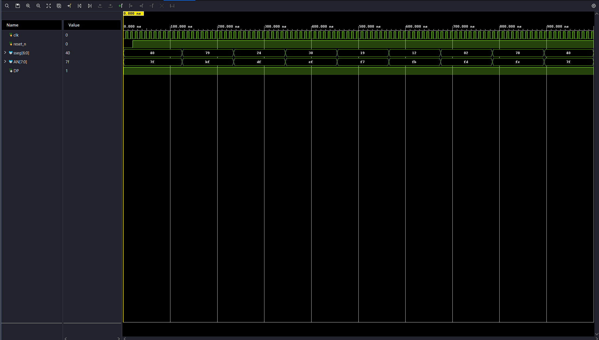

# ECE 3300L — Lab 5: Seven-Segment Display Driver

## Overview

This lab builds a complete time-multiplexed seven-segment display driver for the Nexys A7-100T. The display has eight digits sharing a single set of segment wires; only one digit is physically driven at a time. Cycling through all digits faster than ~60 Hz makes them appear simultaneously lit (persistence of vision). The lab progresses in three parts: revisiting the Lab 3 rudimentary driver with an automatic counter (Part 1), building the complete `sseg_driver` module (Part 2), and integrating it with an up/down/load counter application (Part 3).

---

## Part 1 — Timer-Controlled Counter

Modifies `first_sseg_driver_test` from Lab 3 so that the digit-select signal `sel` is generated automatically by a 3-bit counter, rather than driven by external switches. The counter advances at a rate set by `timer_parameter`. The goal is to find a timer interval fast enough that all eight digits appear lit simultaneously.

### Design

| Block | Module | Role |
|---|---|---|
| Timer | `timer_parameter` | Pulses `done` every `FINAL_VALUE` clock cycles |
| Counter | `udl_counter` (BITS=3) | Increments `sel` on each `done` pulse |
| Display driver | `first_sseg_driver` | Drives one digit at a time; digit `sel` shows value `sel` |

**Timer interval**: `FINAL_VALUE = 50000` → 0.5 ms per digit, 4 ms full scan (250 Hz refresh). The persistence-of-vision threshold is ≈ 200,000 cycles (2 ms/digit, 16 ms full scan).

### FPGA I/O

| Board Signal | Function |
|---|---|
| `clk` (E3) | 100 MHz system clock |
| `CPU_RESETN` (C12) | Active-low reset — clears timer and counter |
| Seven-segment display | Digits 0–7 each show their position number (0–7) |

### Testbench

Simulates with `FINAL_VALUE = 10` for fast runtime (~1.6 µs). `reset_n` is deasserted after 20 ns. The `$monitor` statement prints `AN` and `sseg` on every change, confirming each digit activates in sequence.

**Testbench output:**

---

## Part 2 — Complete `sseg_driver`

A fully self-contained time-multiplexed driver (`sseg_driver`) that accepts eight independent 6-bit inputs and drives all eight digits using the same timer+counter core from Part 1.

### 6-bit Input Format

Each input `I[5:0]` packs three fields:

| Bits | Field | Meaning |
|------|-------|---------|
| `I[5]` | enable | 1 = digit active; 0 = digit blanked (AN stays high) |
| `I[4:1]` | hex | 4-bit value (0–F) passed to `hex2sseg` |
| `I[0]` | DP | 1 = decimal point on |

### Design

| Block | Module | Role |
|---|---|---|
| Timer | `timer_parameter` | Pulses `done` every `FINAL_VALUE` cycles |
| Counter | `udl_counter` (BITS=3) | Cycles `sel` 0→7 on each `done` pulse |
| MUX | assign chain | `sel` picks one of I0–I7 → `D_out[5:0]` |
| Decoder | `decoder_generic` (N=3) | `sel` → one-hot anode; gated by `D_out[5]` (enable) |
| Segment | `hex2sseg` | `D_out[4:1]` → 7-bit segment pattern |
| DP | wire | `~D_out[0]` (active-low) |

**Digit mapping**: `decoder_generic` outputs big-endian `[0:7]`; connecting to `wire [7:0]` maps MSB-to-MSB, so I0 → leftmost digit (AN[7]), I7 → rightmost digit (AN[0]).

### FPGA I/O

Same top-level ports as Part 1 — `sseg_driver_test.v` drives all eight inputs with hardcoded hex digits 0–7 to confirm all positions work.

| Board Signal | Function |
|---|---|
| `clk` (E3) | 100 MHz system clock |
| `CPU_RESETN` (C12) | Active-low reset |
| Seven-segment display | Each digit shows its position number (0–7) |

### Testbench

`sseg_driver_tb.v` uses `FINAL_VALUE = 8` for a fast 1280 ns simulation. I2 has DP enabled; I4 is disabled. Key check: when `sel = 4`, `AN` must be `8'b11111111` (all anodes high — digit blanked).

**Testbench output:**

<!-- Insert screenshot of Vivado simulation waveform here -->

---

## Part 3 — Counter Application

Integrates `sseg_driver` with an 8-bit up/down/load counter (0–255). BCD digits are displayed left-to-right as hundreds → tens → ones on the three leftmost digit positions; the remaining five are blanked.

### Design

| Block | Module | Role |
|---|---|---|
| Button conditioning | `button.v` ×3 | BTNU / BTND / BTNC → single-cycle pulses |
| Counter | `udl_counter` (BITS=8) | 8-bit 0–255 counter; reset by CPU_RESETN |
| BCD conversion | `bin2bcd` + `add_3` | 8-bit binary → 12-bit BCD (from Lab 2) |
| Display | `sseg_driver` | Drives three BCD digits; five positions blanked |

**Counter enable logic**: `up_pulse | down_pulse | load_pulse` drives `enable`; `up` is tied to `up_pulse` and `load` to `load_pulse`. The `udl_counter` casex gives `load` priority, so direction and load never conflict.

### Controls

| Board Signal | Function |
|---|---|
| BTNU (M18) | Count up |
| BTND (P18) | Count down |
| BTNC (N17) | Load SW[7:0] into counter |
| CPU_RESETN (C12) | Reset counter to 0 (hold = stay in reset) |
| SW[7:0] | Load value (0–255) |
| Seven-segment display | Current count as 3-digit decimal |

### Testbench

`counter_application_tb.v` uses `FINAL_VALUE = 8`. Sequence: reset → count up 3× (0→3) → count down 1× (3→2) → load 150 (2→150). `button.v` fires on the 2nd consecutive cycle of input high; each simulated press holds the input for 3 cycles (30 ns) then releases for 30 ns before the next press.

**Testbench output:**

<!-- Insert screenshot of Vivado simulation waveform here -->

### Files needed from previous labs

| File | Source |
|---|---|
| `bin2bcd.v` | Lab 2 |
| `add_3.v` | Lab 2 |
| `first_sseg_driver.v` | Lab 3 |

---

## Provided Modules

| File | Purpose |
|---|---|
| `timer_parameter.v` | Counts to `FINAL_VALUE`, pulses `done` one cycle, resets; `reset_n` + `enable` ports |
| `timer_input.v` | Same as `timer_parameter` but `FINAL_VALUE` is a runtime input port |
| `udl_counter.v` | Parameterized up/down/load counter; `enable` gates counting |
| `button.v` | Synchronizer + debouncer + edge detector → single-cycle pulse |
| `decoder_generic.v` | Parameterized N-to-2^N binary decoder with enable |
| `hex2sseg.v` | 4-bit hex value → 7-bit active-low segment pattern (gfedcba) |
| `first_sseg_driver.v` | Carried over from Lab 3; drives one digit using decoder + hex2sseg |

## Vivado Notes

- Port names in XDC constraints are case-sensitive and must exactly match Verilog port names.
- When switching top modules between parts, right-click the correct module in Sources → **Set as Top** before synthesizing.
- `CPU_RESETN` is connected directly (no `button.v`) — the Nexys A7 hardware-debounces it and reset must be level-sensitive.

## Hardware

- **Board**: Digilent Nexys A7-100T
- **FPGA**: Xilinx Artix-7 XC7A100T
- **Clock**: 100 MHz system clock (pin E3, LVCMOS33)
